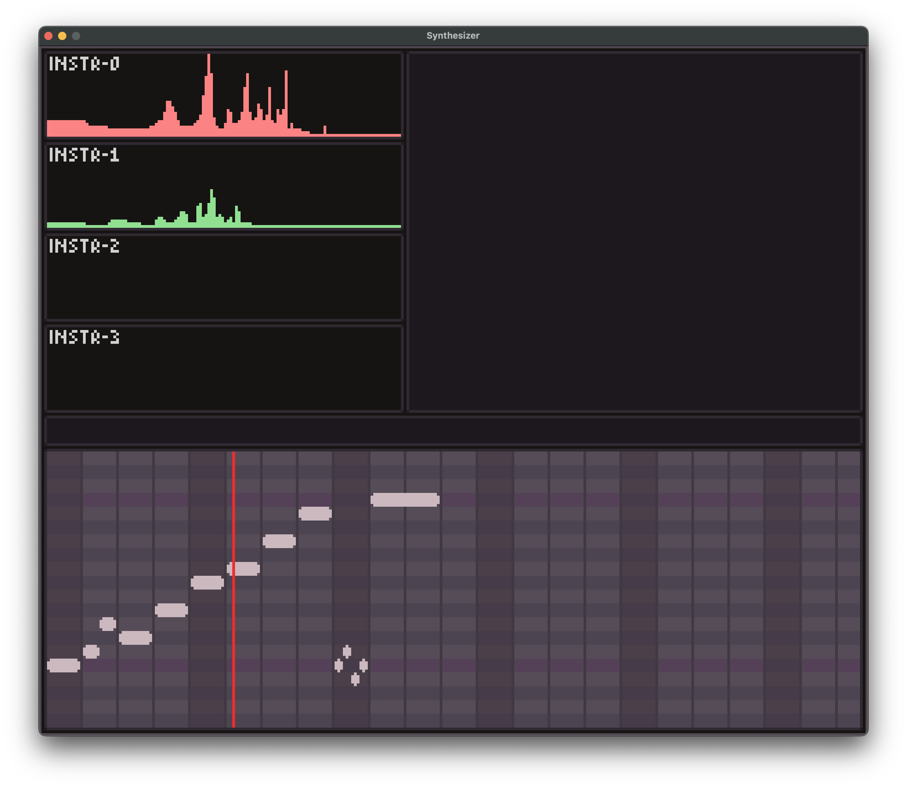

# cancrizans

(formerly `fm`)

a synthesiser, early WIP. I'm currently in the process of porting the [old](https://github.com/zac-garby/fm/tree/old) C version to Rust, because segfaults are annoying.

once this rewrite is complete, the features will include:

 - [X] FM instruments with arbitrary custom algorithms and feedback loops etc
 - [X] songs, loadable and storable in a human-readable and human-editable format
 - [X] an aesthetic GUI (I had to make a whole GUI library to make it look how I want--I hope you're happy.)
 - [ ] `.wav` file export
 - [X] filters and effects
 - [ ] more than this hopefully
 
## why the name?

["cancrizans"](https://www.merriam-webster.com/dictionary/cancrizans) describes a canon where the theme is played backwards against itself. the most famous example of this is Bach's [crab canon](https://en.wikipedia.org/wiki/The_Musical_Offering#Structure_and_instrumentation), and Rust's logo is a crab, sooo...

(this is also my excuse for only supporting four instruments in the GUI (a purely UI limitation), since that is the number of parts in the largest canon in his Music Offering. though arguably it should be six, for his six-part fugue. oh well.)