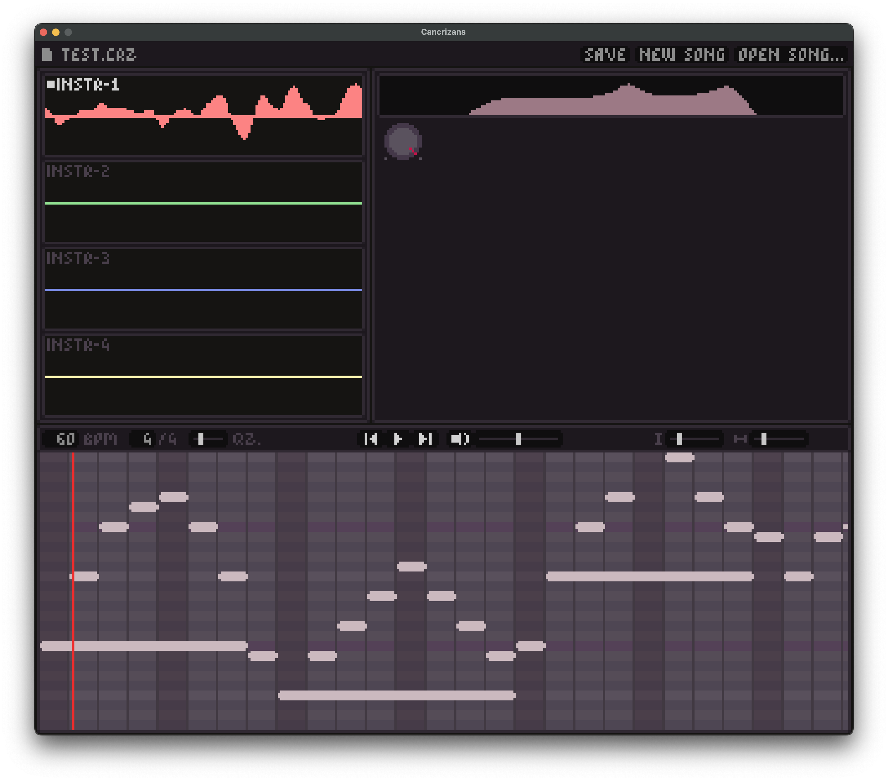

# cancrizans

(formerly `fm`)

A synthesiser, early WIP. I'm currently in the process of porting the [old](https://github.com/zac-garby/fm/tree/old) C version to Rust, because segfaults are annoying.

Once this rewrite is complete, the features will include:

 - FM instruments with arbitrary custom algorithms and feedback loops etc
 - Songs, loadable and storable in a human-readable and human-editable format
 - A nice-looking GUI
 - `.wav` file export
 - Filters and effects
 
## why the name?

[https://www.merriam-webster.com/dictionary/cancrizans](cancrizans) describes a canon where the theme is played backwards against itself. the most famous example of this is Bach's [crab canon](https://en.wikipedia.org/wiki/The_Musical_Offering#Structure_and_instrumentation), and Rust's logo is a crab, sooo...